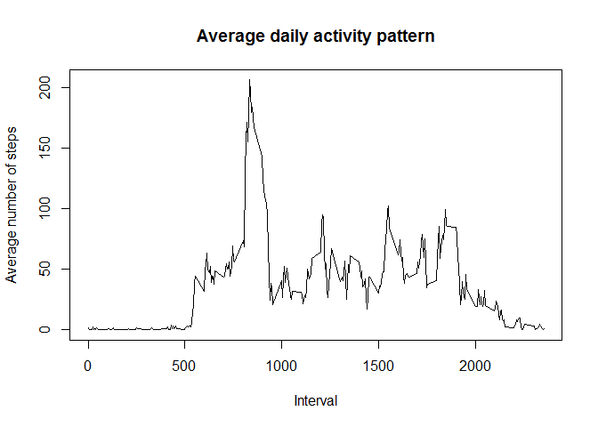

# Reproducible Research: Peer Assessment 1


## Loading and preprocessing the data

```r
unzip("activity.zip")
act <- read.csv("activity.csv", sep = ",", header = T)
```
## What is mean total number of steps taken per day?

```r
total_steps <- tapply(act$steps,act$date,sum,na.rm=T)
hist(total_steps, main = "Histogram of total steps", xlab = "Total Steps per day" )
```

 

```r
mean(total_steps)
```

```
## [1] 9354.23
```

```r
median(total_steps)
```

```
## [1] 10395
```


## What is the average daily activity pattern?

```r
interval_mean <- tapply(act$steps, act$interval, mean, na.rm=T)
plot(unique(act$interval), interval_mean, type ="l", xlab = "Interval", ylab = "Average number of steps", main = "Average daily activity pattern") 
```

 

```r
interval_mean[which(interval_mean==max(interval_mean))]
```

```
##      835 
## 206.1698
```


## Imputing missing values

```r
sum(is.na(act$steps))
```

```
## [1] 2304
```

```r
act2 <- act
act2$means <- interval_mean
act2$steps <- replace(act2$steps, is.na(act2$steps), interval_mean)
act2$means <- NULL
total_steps2 <- tapply(act2$steps,act2$date,sum,na.rm=T)
hist(total_steps2, main = "Total Steps with replacement", xlab="Interval", ylab = "Total Steps")
```

 

```r
mean(total_steps2)
```

```
## [1] 10766.19
```

```r
median(total_steps2)
```

```
## [1] 10766.19
```

## Are there differences in activity patterns between weekdays and weekends?

```r
act2$day_type <- as.factor(ifelse((weekdays(as.Date(act2$date))=="Saturday")|(weekdays(as.Date(act2$date))=="Sunday"),"weekend","weekday"))
# summary(act2$day_type)
aggdata <- aggregate(act2$steps, by = list(act2$interval, act2$day_type), FUN =mean)
library("lattice")
xyplot(aggdata$x~aggdata$Group.1|aggdata$Group.2, type = "l", layout = c(1,2), xlab = "Interval", ylab = "Number of Steps", main = "Average daily activity pattern by day type")
```

 

